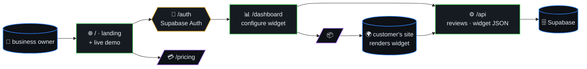
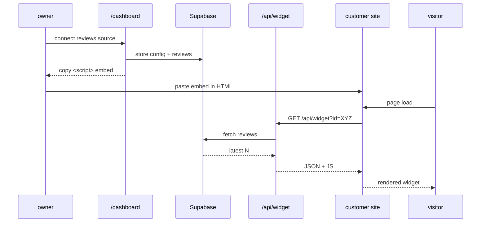
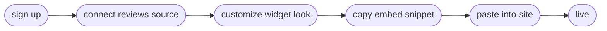

# Review Widget

> Embeddable review-showcase widget for small businesses. Three steps
> to up-and-running: connect your reviews, customize the widget, drop
> the embed snippet on your site.



## Table of contents

- [Stack](#stack)
- [Architecture](#architecture)
- [Embed flow (sequence)](#embed-flow-sequence)
- [Setup steps](#setup-steps)
- [Getting Started](#getting-started)

## Embed flow (sequence)



## Setup steps



## Stack

- Next.js 16 + React 19 + Tailwind CSS 4
- Supabase (auth + database)
- Vercel deployment
- TypeScript strict mode
- Bun package manager

## Architecture

- `/` — Landing page (DemoWidget, PricingSection)
- `/auth` — Supabase auth flows
- `/dashboard` — Configure the widget
- `/pricing` — Plans
- `/api/*` — Widget JSON, reviews ingestion

## Getting Started

```bash
bun install
bun run dev
```

Open [http://localhost:3000](http://localhost:3000).
